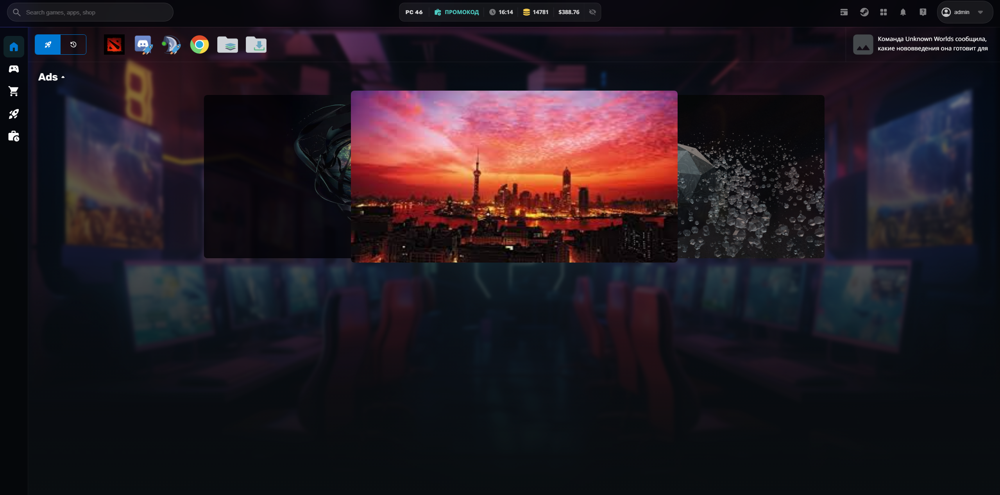
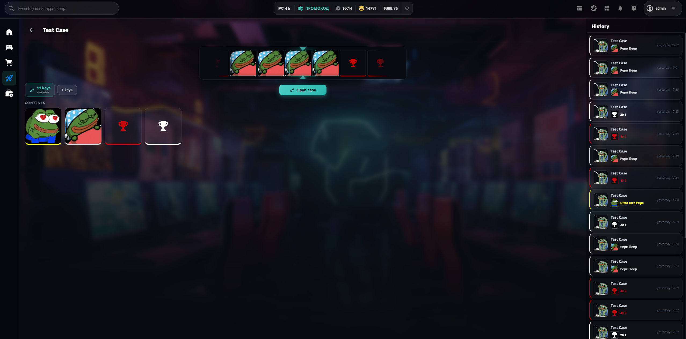
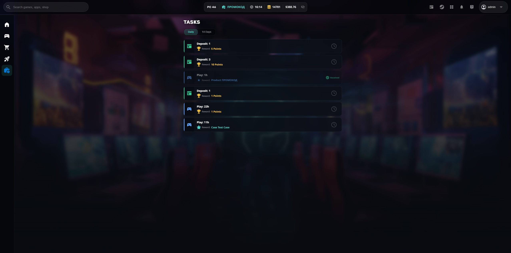

# GGBook — Gizmo Client UI Integration (v2)

> [!IMPORTANT]
> **Compatibility notice:** This project is built for **Gizmo Client version 2** and is **not compatible with Gizmo Client version 3**.
>
> **GGBook required:** The Cases, Tasks, Referral, Ads, and Steam Top-Up modules will not function without a valid [GGBook](https://ggbook.ru) server configuration. All GGMod features are silently disabled if the configuration is absent or the server is unreachable.

---

## Screenshots

| Home page | Cases | Tasks |
|---|---|---|
|  |  |  |

---

## Overview

This repository is a modified build of [GAMP/Gizmo.Client.UI](https://github.com/GAMP/Gizmo.Client.UI) — the open-source Blazor WebView WPF skin for Gizmo Client 2.x — with a full integration of the **GGBook** platform API.

GGBook is a club management extension that adds gamification features (cases/loot boxes, daily tasks, referral system, promotions) on top of the base Gizmo Client.

---

## What's included

### GGBook Modules

| Module | Description |
|---|---|
| **Cases** | Loot-box style case opening with animated roulette, key purchases, reward history |
| **Tasks** | Daily / weekly / custom task groups with progress tracking and reward claiming |
| **Referral system** | Auto-fires referral and ad-code registration on new user sign-up |
| **Config-driven** | All modules are toggled server-side via `/client/config` — zero client config changes needed |

### Localization

All UI strings are localized into **13 languages** via `GGModL10n`:

`English` `Russian` `Ukrainian` `Belarusian` `Kazakh` `Uzbek` `Azerbaijani` `Georgian` `Armenian` `Kyrgyz` `Tajik` `Turkmen` `Romanian`

Slavic / Romanian plural forms are handled automatically.

### Navigation

- Module navigation icons (Cases, Tasks) are shown or hidden based on the server config response
- Icons remain hidden until the config is resolved to avoid flicker on startup
- Navigating to a disabled module's page shows a loading spinner until config resolves, then renders nothing (the icon is already hidden)

### Performance optimizations

- **WebView2 suspend on minimize** — Chromium JS engine and GPU compositor are fully suspended when the window is minimized, reducing CPU to near zero
- **Removed dead code** — `CustomTaskbar`, `TaskbarWindow`, `VolumeService`, and related files were removed as they were not referenced in the active UI
- **Upstream merge isolation** — All GGBook-specific logic in `App.razor.cs` was extracted into `App.razor.GGMod.cs` (partial class), minimizing the diff against the upstream repository

---

## Prerequisites

- [Gizmo Client 2.x](https://gizmopowered.com) installed on the target machine
- A running [GGBook](https://ggbook.ru) server instance
- .NET 6 SDK (for building)
- Node.js 16+ (for webpack asset build)

---

## Configuration

All GGBook settings live in the skin's `composition.json`:

```json
{
  "UIComposition": {
    "AppAssembly": "Gizmo.Client.UI.dll",
    "AdditionalAssemblies": [ "Gizmo.Web.Components.dll" ],
    "RootComponentType": "Gizmo.Client.UI.App,Gizmo.Client.UI",
    "NotificationsComponentType": "Gizmo.Client.UI.Components.NotificationsHost,Gizmo.Client.UI"
  },
  "GGMod": {
    "GGBookBaseUrl": "https://your-ggbook-server.example.com",
    "GGBookStorageUrl": "https://your-ggbook-storage.example.com",
    "UserToken": "<base64-user-token>",
    "ClubToken": "<club-token>"
  }
}
```

| Field | Description |
|---|---|
| `GGBookBaseUrl` | Base URL of your GGBook API server |
| `GGBookStorageUrl` | Base URL for static assets (case/reward images) |
| `UserToken` | Authorization token (sent as `Authorization: Basic <token>`) |
| `ClubToken` | Club identifier (sent as `Club: <token>`) |

If `GGBookBaseUrl` is empty or missing, all GGMod features are automatically disabled — the skin works as a standard Gizmo Client skin.

---

## Building

```bash
# 1. Clone with submodules
git clone --recurse-submodules https://github.com/Parazeya/GGBook.Gizmo.Client.UI.git
cd GGBook.Gizmo.Client.UI

# 2. Build skin
cd Gizmo.Client.UI.Host.WPF
dotnet publish -c Release -o ../deploy

```

---

## Deployment

### 1. Skin DLLs (Gizmo.Client.UI)

Copy `Gizmo.Client.UI.dll` and `Gizmo.Web.Components.dll` into your Gizmo Client skin folder:

```
C:\Program Files\NETProjects\Gizmo Server\skins\<SkinName>\Gizmo.Client.UI.dll
C:\Program Files\NETProjects\Gizmo Server\skins\<SkinName>\Gizmo.Web.Components.dll
```

Place your configured `composition.json` in the same folder.

### 2. Styles

Build the webpack bundle from the `Gizmo.Client.UI/Gizmo.Client.UI/` folder:

```bash
cd Gizmo.Client.UI/Gizmo.Client.UI
npm run build_prod
```

Then copy the entire contents of `wwwroot/` into the skin's content folder:

```
C:\Program Files\NETProjects\Gizmo Server\skins\<SkinName>\wwwroot\_content\Gizmo.Client.UI\
```

Restart the Gizmo Client after deploying.

---

## Project structure

```
├── Gizmo.Client.UI/                    # Main Blazor component library
│   ├── App.razor.cs                    # Upstream lifecycle (minimal GGMod footprint)
│   ├── App.razor.GGMod.cs              # GGBook config fetch + post-registration hooks
│   ├── Code/Services/
│   │   ├── GGBookClient.cs             # HTTP client wrapper for GGBook API
│   │   ├── GGModConfig.cs              # Runtime feature flags (populated from /client/config)
│   │   ├── GGModL10n.cs                # Localization for all GGMod strings (13 languages)
│   │   └── GGBookRegistrationContext.cs # Pending referral/ad-code state across registration
│   ├── Pages/Cases/                    # Cases module (CasesIndex.razor + .razor.cs)
│   └── Pages/Tasks/                    # Tasks module (TasksIndex.razor + .razor.cs)
├── Gizmo.Client.UI.Host.WPF/           # WPF host (HostWindow with WebView2 suspend)
├── dist/webmodules/                    # Pre-built plugin DLL (ready to deploy)
├── Gizmo.Client.UI.GGMod/             # Early GGMod scaffold (not active in production)
└── Submodules/                         # Upstream Gizmo dependencies
```

---

## Upstream compatibility

This project tracks [GAMP/Gizmo.Client.UI](https://github.com/GAMP/Gizmo.Client.UI). GGBook-specific changes are isolated to:

| File | Change |
|---|---|
| `App.razor.cs` | 3 lines marked `// GGMod` (event wiring + one await) |
| `App.razor.GGMod.cs` | New file — owns all GGBook logic |
| `Shared/HeaderModulesMenu.razor` | 1-line filter call |
| `Shared/HeaderModulesMenu.razor.cs` | `ShouldShowModule()` helper + event subscription |
| `Pages/Login/RegistrationBasicFields.razor` | GGBook referral/ad fields |
| `Shared/UserActionsBar.razor` | Steam Top-Up button |

When upstream releases an update, apply the upstream diff to the upstream-touched files and keep the `// GGMod` markers as re-apply guides.

---

## License

This project inherits the license of the upstream [GAMP/Gizmo.Client.UI](https://github.com/GAMP/Gizmo.Client.UI) repository. GGBook integration code is provided as-is.
